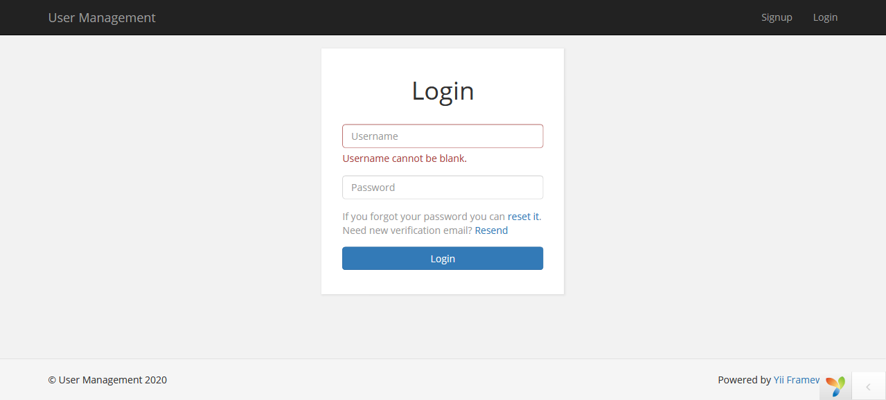
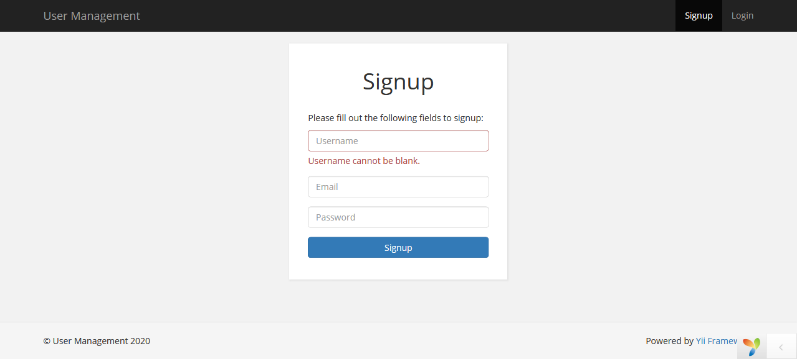
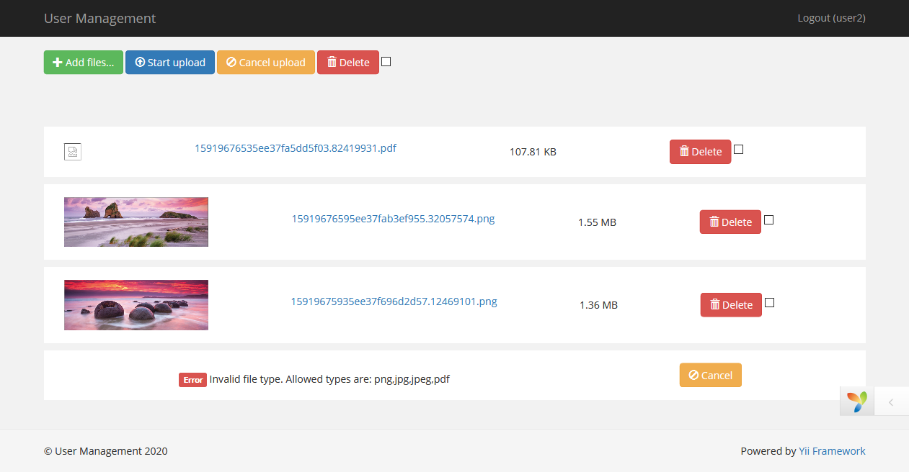
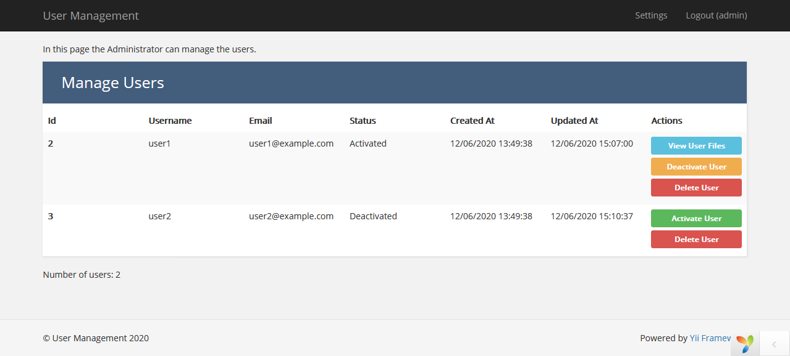
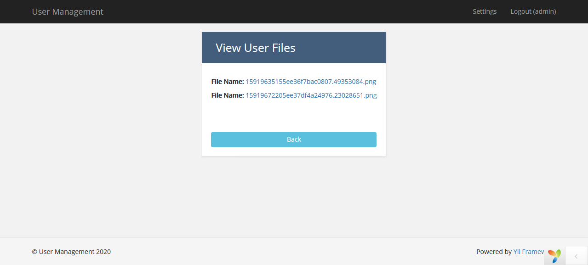
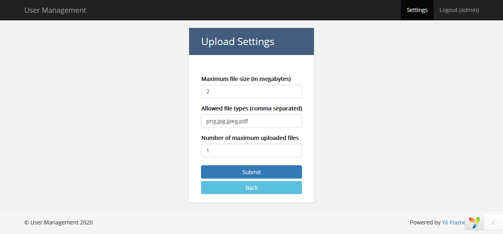

# User Management
Simple project implemented on Yii 2 framework.

## Description
This is a simple user management project that features two types of users 

( Administrator and simple user ).

On Login, users are being identified by their role.

Administrators have access to a users grid that contains information about signed up users.
Certain actions are available to admin users like Activating, Deactivating or Deleting a user.
They can also see the files each user has uploaded via the View User Files action which is available only for users 
who have uploaded files. Admins can manage basic file related settings, like file size limit, maximum files per user permitted and acceptable file types
via the Settings view.


Simple users see a file upload form and actions that can be performed on chosen files.
Users can select files and then proceed with either uploading or deleting these files.
Mass actions are available as well. If a user violates any rule defined by the admin Settings an error message pops and the file upload is considered failed.


## Installation
- clone this repo
- cd to project directory
- Run the following commands
```sh
   $ php init
   $ composer update
```
- configure dbname in file: common/config/main-local.php at line: 6
- Run migrate
```sh
   $ php yii migrate
```

## Test Users
Users created by yii migrate.
```
username: admin
password: user-admin
role: administrator
```
```
username: user1
password: user-user
role: simple user
```
```
username: user2
password: user-user
role: simple user
```

## Comments
I used the advanced yii application template, but all the functionalities are implemented on the frontend page.

## Screenshots
Login Page


Signup Page


User Upload Files Page


Manage Users Page


View User Files Page


Upload Settings Page
